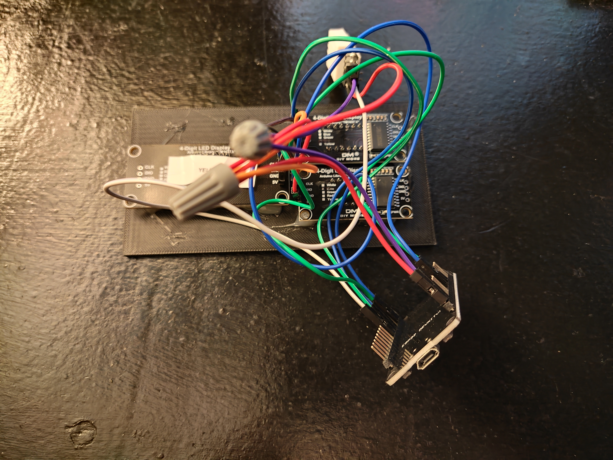
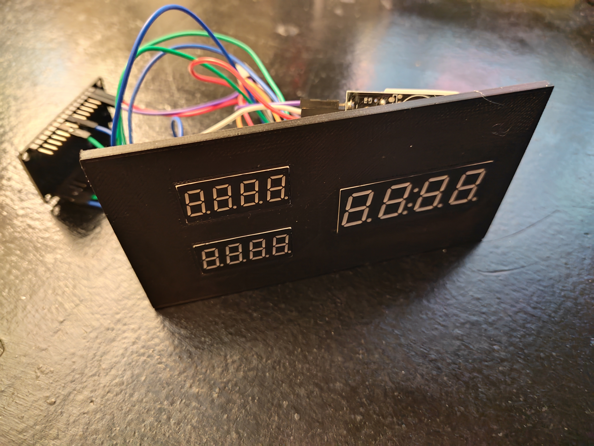
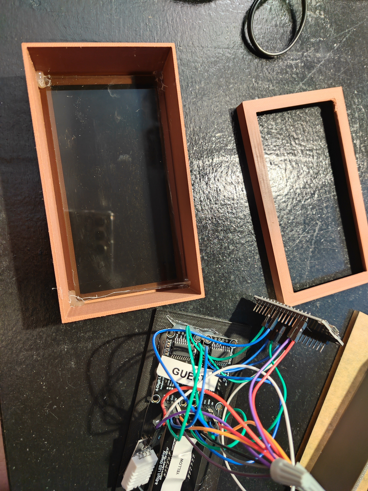
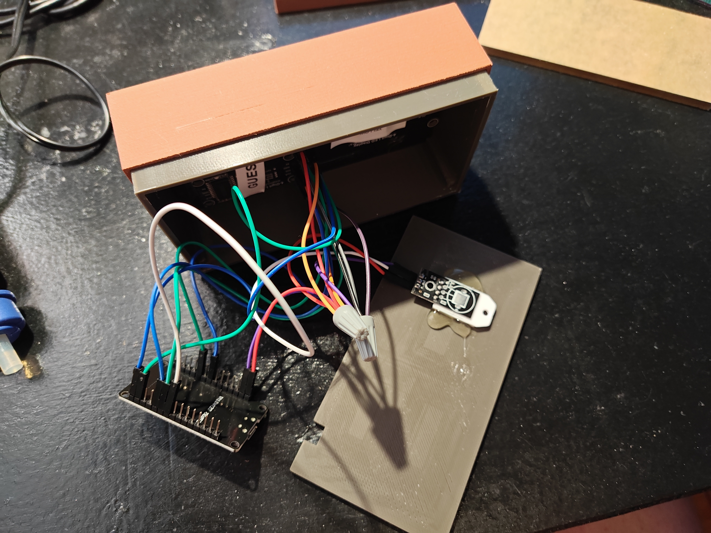
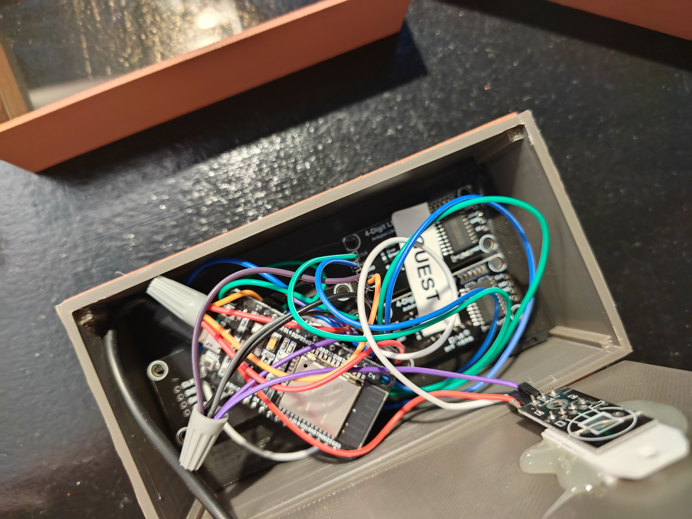
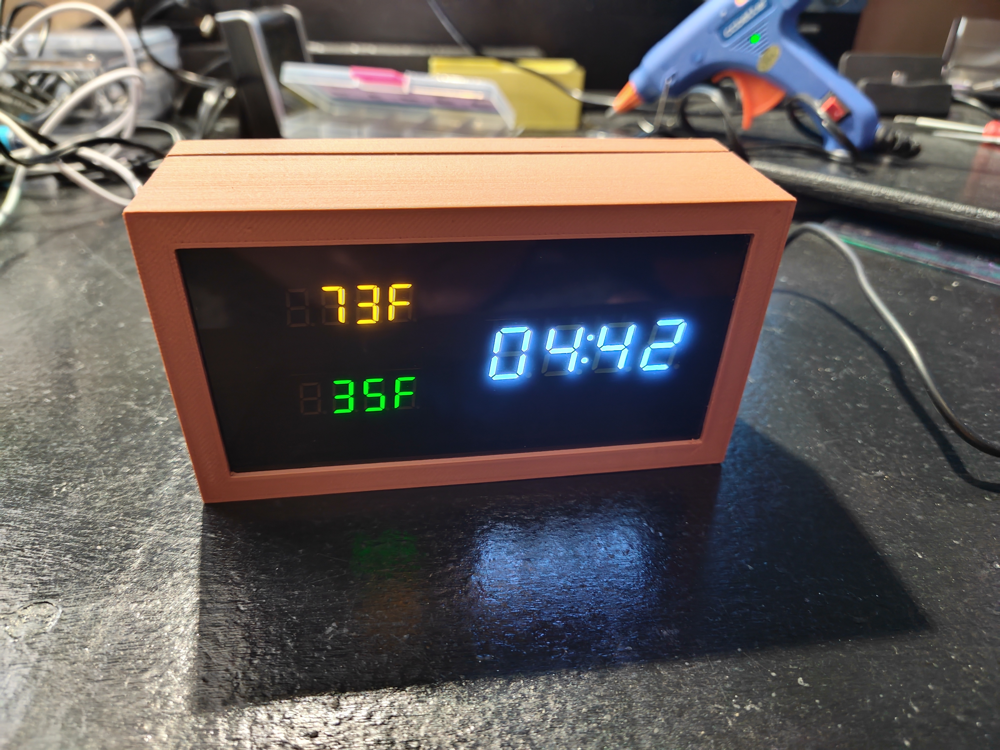
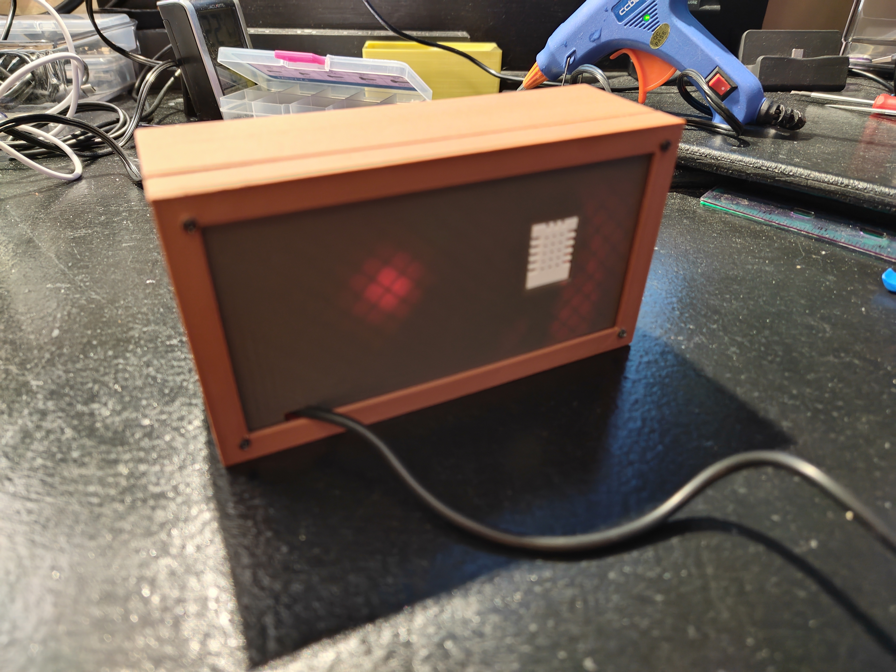

# ESP32 Time and Temperature Display

This project uses an ESP32 microcontroller to display the current time and temperatures on three TM1637 displays. The first display shows the current time in 12-hour format with a blinking colon and PM indicator. The second display shows the indoor temperature from a DHT22 sensor. The third display shows the outdoor temperature fetched from an online weather API.

## Hardware Setup

### Components Required

- 1 x ESP32 Development Board
- 3 x TM1637 4-Digit 7-Segment Displays
- 1 x DHT22 Temperature and Humidity Sensor
- Jumper wires
- Breadboard (optional)

### Wiring Diagram

#### TM1637 Displays

- **Display 1 (Time)**
  - CLK1: GPIO 22
  - DIO1: GPIO 23

- **Display 2 (Indoor Temperature)**
  - CLK2: GPIO 19
  - DIO2: GPIO 21

- **Display 3 (Outdoor Temperature)**
  - CLK3: GPIO 32
  - DIO3: GPIO 25

#### DHT22 Sensor

- VCC: 3.3V or 5V
- GND: Ground
- Data: GPIO 18

### Notes

- Ensure all components share a common ground with the ESP32.
- Use appropriate pull-up resistors if necessary for the DHT22 data line.

## Build Process

### Construction Photos







### Finished Product




## Software Setup

### Prerequisites

- [PlatformIO](https://platformio.org/) installed on your development environment.
- An internet connection for the ESP32 to fetch weather data.

### Configuration

1. **Copy Configuration File**

   Copy `src/config_shadow.h` to `src/config.h` and update the configuration values:

   ```bash
   cp src/config_shadow.h src/config.h
   ```

2. **Edit `config.h`**

   Update the following configuration values in `src/config.h`:

   #### Time Settings
   ```cpp
   #define TIME_ZONE -5        // Your timezone offset from UTC (e.g., -5 for EST)
   #define DST_OFFSET 1        // Daylight Saving Time offset (1 for DST, 0 for no DST)
   ```

   #### Display Brightness (0-7)
   ```cpp
   #define TIME_DISPLAY_BRIGHTNESS 3     // Brightness for time display
   #define INSIDE_TEMP_BRIGHTNESS 1      // Brightness for indoor temperature display
   #define OUTSIDE_TEMP_BRIGHTNESS 1     // Brightness for outdoor temperature display
   ```

   #### Temperature Calibration
   ```cpp
   #define TEMP_OFFSET 0.0     // Temperature offset in degrees (adjust if sensor readings need calibration)
   ```

   #### WiFi Settings
   ```cpp
   const char* ssid = "Your_WiFi_SSID";
   const char* password = "Your_WiFi_Password";
   ```

   #### Data Services Configuration
   ```cpp
   // DataHub API endpoint
   const char* datahub_host = "https://your.datahub.endpoint";

   // Weather API settings
   const char* weather_api_endpoint = "https://your.weather.api.endpoint";
   const char* device_name = "your-device-name";
   const char* zipcode = "your-zipcode";

   // Location coordinates (for weather data)
   float latitude = YOUR_LATITUDE;    // e.g., 40.7128
   float longitude = YOUR_LONGITUDE;  // e.g., -74.0060
   ```

   #### Update Intervals
   ```cpp
   // Weather updates
   const unsigned long WEATHER_UPDATE_INTERVAL = 60000; // Weather update interval in milliseconds

   // Loop manager settings
   const int API_UPDATE_INTERVAL = 600;     // Update API every 600 samples (10 minutes)
   const int RESTART_THRESHOLD = 1800;    // Restart after 1800 samples (30 minutes)
   ```

   These settings control how often the device:
   - Fetches new weather data (WEATHER_UPDATE_INTERVAL)
   - Sends data to your API endpoint (API_UPDATE_INTERVAL)
   - Automatically restarts to prevent memory issues (RESTART_THRESHOLD)

3. **Pin Configuration**

   The default pin configuration is set up for common ESP32 boards. If you need to change the pin assignments, modify these values:

   ```cpp
   // Display pins
   #define CLK1 22    // Time display clock
   #define DIO1 23    // Time display data
   #define CLK2 19    // Indoor temperature display clock
   #define DIO2 21    // Indoor temperature display data
   #define CLK3 32    // Outdoor temperature display clock
   #define DIO3 25    // Outdoor temperature display data

   // Temperature sensor pin
   #define DHTPIN 18  // DHT22 data pin
   ```

### Building and Uploading

1. Connect your ESP32 to your computer via USB.
2. Open the project in your PlatformIO environment.
3. Build and upload the firmware to the ESP32.

### License

This project is licensed under the GNU General Public License v3.0. See the [LICENSE](https://www.gnu.org/licenses/gpl-3.0.en.html) file for details.

### Author

- **Kevin Hinds**
- Website: [www.kevinhinds.com](http://www.kevinhinds.com)
- Date: 2025-01-28 

## GNU General Public License

This program is free software: you can redistribute it and/or modify it under the terms of the GNU General Public License as published by the Free Software Foundation, either version 3 of the License, or (at your option) any later version.

This program is distributed in the hope that it will be useful, but WITHOUT ANY WARRANTY; without even the implied warranty of MERCHANTABILITY or FITNESS FOR A PARTICULAR PURPOSE. See the GNU General Public License for more details.

You should have received a copy of the GNU General Public License along with this program. If not, see [https://www.gnu.org/licenses/](https://www.gnu.org/licenses/). 
